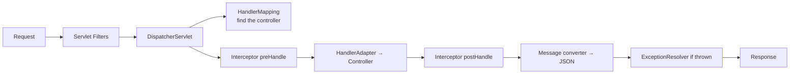

# Spring Web and Boot Internals

## Why It Matters

Explains how a request actually flows, what auto-configuration is doing, and the MVC-versus-WebFlux decision that interviewers use to test whether you understand blocking I/O.

## Request Flow (Spring MVC)



**`DispatcherServlet` is the front controller** — a single servlet routing everything, which is [Front Controller](../03%20Low%20Level%20Design/Design%20Patterns/Behavioural/Chain%20of%20Responsibility.md) plus a handler registry.

### Filter vs Interceptor

| | **Filter** | **Interceptor** |
|---|---|---|
| Layer | Servlet container — **before Spring** | Spring MVC |
| Sees | Raw request/response | Handler method, model |
| Can modify the body | **Yes** (with wrapping) | Not easily |
| Use | Auth, CORS, logging, compression, tracing IDs | Per-handler concerns, model enrichment |

**Security belongs in a filter** — Spring Security is a filter chain, so it runs before the DispatcherServlet and can reject a request without any Spring MVC involvement.

## Exception Handling

```java
@RestControllerAdvice
public class GlobalExceptionHandler {

    @ExceptionHandler(EntityNotFoundException.class)
    ResponseEntity<ApiError> notFound(EntityNotFoundException e) {
        return ResponseEntity.status(404)
            .body(new ApiError("NOT_FOUND", e.getMessage(), MDC.get("requestId")));
    }

    @ExceptionHandler(MethodArgumentNotValidException.class)
    ResponseEntity<ApiError> validation(MethodArgumentNotValidException e) { ... }
}
```

**One `@RestControllerAdvice` gives every endpoint a consistent error shape.** Never let a raw stack trace reach the client — it leaks internals and gives clients nothing machine-readable. See [API Design](../04%20High%20Level%20Design/Core%20Concepts/API%20Design.md).

## Validation

```java
public record CreateOrderRequest(
    @NotBlank String customerId,
    @Min(1) @Max(100) int quantity,
    @Email String email
) {}

@PostMapping("/orders")
ResponseEntity<?> create(@Valid @RequestBody CreateOrderRequest req) { ... }
```

**`@Valid` on the parameter is what triggers validation** — the annotations alone do nothing without it. A missing `@Valid` is a silent no-op and a common bug.

For nested objects, `@Valid` must be applied on the field too, or nesting isn't validated.

## Auto-Configuration

`@SpringBootApplication` = `@Configuration` + `@ComponentScan` + `@EnableAutoConfiguration`.

**How auto-configuration works:**

1. Spring reads `META-INF/spring/...AutoConfiguration.imports` from every jar on the classpath
2. Each candidate configuration is filtered by **conditional annotations**
3. Surviving configurations contribute beans

| Condition | Meaning |
|---|---|
| `@ConditionalOnClass` | The class is on the classpath |
| `@ConditionalOnMissingBean` | **You haven't defined one yourself** |
| `@ConditionalOnProperty` | A property has a given value |
| `@ConditionalOnWebApplication` | It's a web app |

**`@ConditionalOnMissingBean` is the mechanism that makes Boot feel magical yet overridable** — define your own `DataSource` and Boot's backs off automatically. That's the answer to "how does Spring Boot know not to configure something?"

**Debug with `--debug`** — it prints the full conditions evaluation report showing what matched and what didn't. That's the tool for "why isn't my bean there?"

## Actuator

| Endpoint | Use |
|---|---|
| `/health` | **Liveness and readiness probes** |
| `/metrics`, `/prometheus` | Micrometer metrics |
| `/info` | Build and version info |
| `/loggers` | **Change log levels at runtime — no restart** |
| `/threaddump`, `/heapdump` | Production diagnostics |
| `/env`, `/configprops` | Effective configuration |

**Separate liveness from readiness:**

```properties
management.endpoint.health.probes.enabled=true
```

`/health/liveness` — is the process alive? `/health/readiness` — can it serve traffic?

**Readiness may check dependencies; liveness must not.** If liveness checks the database, a database blip restarts every pod and turns a dependency outage into a full outage. Same reasoning as in [Kubernetes](../13%20Kubernetes/Kubernetes%20Core%20Concepts.md).

**Never expose Actuator publicly.** Bind it to a separate management port and restrict network access — `/heapdump` and `/env` are serious information disclosure.

## MVC vs WebFlux

| | **Spring MVC** | **WebFlux** |
|---|---|---|
| Model | Thread per request, blocking | **Event loop, non-blocking** |
| Stack | Servlet (Tomcat) | Netty |
| Return types | `T`, `ResponseEntity<T>` | `Mono<T>`, `Flux<T>` |
| Threads under load | Hundreds to thousands | **A handful** |
| Debugging | Straightforward stack traces | **Hard — reactive stack traces** |
| Ecosystem | Everything | Requires reactive drivers throughout |

**Choose WebFlux only when:** you have very high concurrency with low per-request CPU, you're doing streaming, and **every** downstream call is non-blocking.

**One blocking call in a WebFlux app destroys it** — blocking an event-loop thread stalls every request that thread was serving. JDBC is blocking, so a WebFlux app with JPA is usually worse than MVC.

**Virtual threads have largely removed the reason to choose WebFlux.** Java 21 virtual threads give you MVC's simple blocking code with WebFlux-like scalability:

```properties
spring.threads.virtual.enabled=true
```

**The honest recommendation for most systems: MVC with virtual threads.** You get the scalability without reactive complexity or the debugging cost. Saying this demonstrates current knowledge rather than reciting a 2019 comparison.

## Configuration And Profiles

Resolution order (highest wins): command-line args → environment variables → `application-{profile}.yml` → `application.yml` → defaults.

```java
@ConfigurationProperties(prefix = "app.payment")
@Validated
public record PaymentProps(@NotBlank String apiUrl, @NotNull Duration timeout) {}
```

**Type-safe, validated at startup, IDE-completable.** Prefer this to scattered `@Value`. Validation failure at startup beats a `NumberFormatException` at 3am.

**Externalise secrets** — environment variables or a secret manager, never `application.yml` in the repository.

## Testing

| Annotation | Loads | Speed |
|---|---|---|
| `@SpringBootTest` | **The whole context** | Slow |
| `@WebMvcTest` | Web layer only, mocked services | Fast |
| `@DataJpaTest` | JPA layer, in-memory or Testcontainers | Fast |
| Plain JUnit + Mockito | Nothing | **Fastest** |

**Most tests should not start Spring at all.** Constructor injection means you can instantiate a service with mocks directly — which is a large part of why constructor injection matters.

**Use Testcontainers over H2** for repository tests. H2 has different SQL semantics, so tests pass against H2 and fail in production against Postgres — a genuinely common and expensive trap.

## Common Mistakes

- Missing `@Valid`, so validation silently doesn't run
- No `@RestControllerAdvice`, so stack traces reach clients
- Liveness probes that check dependencies
- Actuator exposed publicly
- WebFlux with blocking JDBC
- `@SpringBootTest` for everything, making the suite slow
- H2 in tests, Postgres in production
- Secrets committed in configuration files

## Related Topics

- [Spring Core and Dependency Injection](Spring%20Core%20and%20Dependency%20Injection.md)
- [Spring Transactions and AOP](Spring%20Transactions%20and%20AOP.md)
- [API Design](../04%20High%20Level%20Design/Core%20Concepts/API%20Design.md)
- [Kubernetes Core Concepts](../13%20Kubernetes/Kubernetes%20Core%20Concepts.md)

## Revision Summary

Filters run before Spring and handle security; interceptors handle per-handler concerns. Auto-configuration is conditional bean registration, backing off via `@ConditionalOnMissingBean`. Separate liveness from readiness and never let liveness check dependencies. Prefer MVC with virtual threads over WebFlux unless the entire stack is non-blocking.

## Quick Recall

- `DispatcherServlet` is the front controller
- Filter = pre-Spring (security); interceptor = Spring MVC
- `@Valid` is required — annotations alone do nothing
- `@ConditionalOnMissingBean` is how Boot backs off
- `--debug` prints the conditions report
- **Liveness must not check dependencies**
- Never expose Actuator publicly
- WebFlux + JDBC = broken; **MVC + virtual threads** is the modern default
- Testcontainers, not H2
